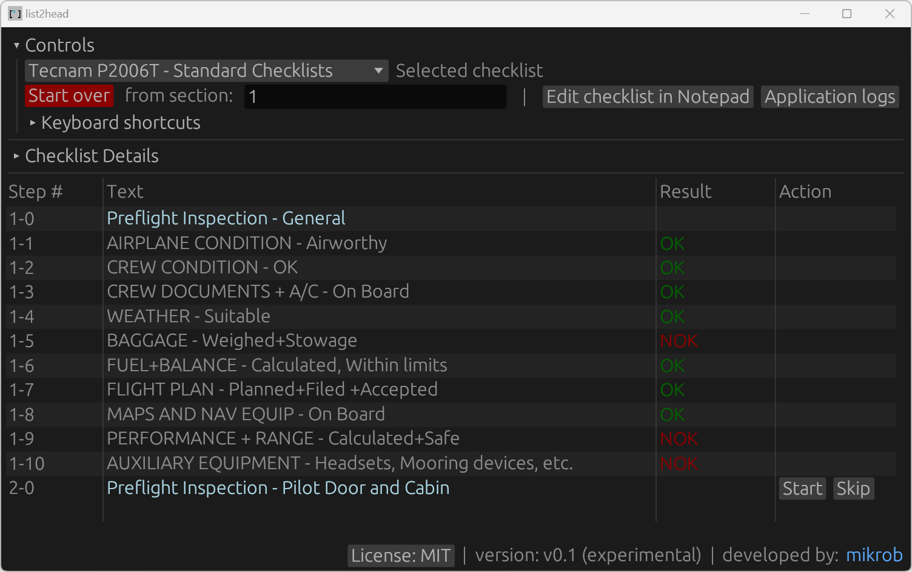
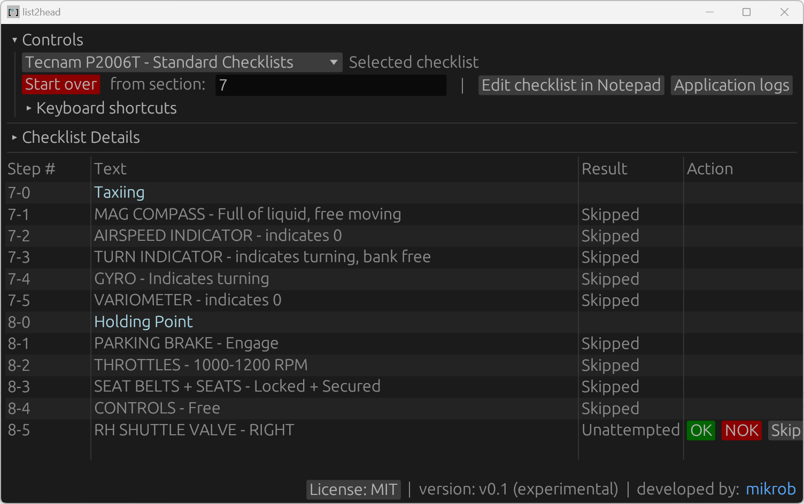

# list2head

list2head makes memorization of aviation related and other flows and checklists a breeze. Step-by-step playback, smart structure supporting sections, steps and dedicated description and comment fields, keyboard shortcuts and easy editing of .json based flows are only the main highlights.

The application includes sample emergency and standard checklists for C-172 and Tecnam P2006T (not to be used in training or real flying, the data have been included exclusively for illustrative reasons).

**Build & run**

If you wish to test out the app straight away, get it from the [app's page](https://www.mikrob.it/list2head_app_detail.php) on [mikrob.it](https://www.mikrob.it).

Alternatively:
* Clone & build
* Copy the resources folder and its contents to the folder where the list2head.exe resides
* Execute list2head.exe, interact with the app through the GUI

**Notes**

* Application logs are stored at log/list2head.log or directly accessible clicking the Application Logs button
* The application uses .json format, experiment with existing checklists, create your own
* Keyboard shortcuts are supported, expand Controls section for list 

**Screenshots**

